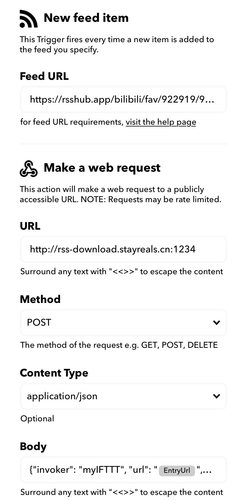

- [**A**utomatic **V**ideo **D**ownloader with **R**SS and **I**FTTT (AVDRI)](#automatic-video-downloader-with-rss-and-ifttt-avdri)
  - [用到的工具](#%e7%94%a8%e5%88%b0%e7%9a%84%e5%b7%a5%e5%85%b7)
  - [安装与使用](#%e5%ae%89%e8%a3%85%e4%b8%8e%e4%bd%bf%e7%94%a8)
    - [1. 监控RSS更新](#1-%e7%9b%91%e6%8e%a7rss%e6%9b%b4%e6%96%b0)
    - [2. IFTTT配置](#2-ifttt%e9%85%8d%e7%bd%ae)
    - [2.5. `frp` 配置（非必需）](#25-frp-%e9%85%8d%e7%bd%ae%e9%9d%9e%e5%bf%85%e9%9c%80)
    - [3. rss-downloader-rs运行](#3-rss-downloader-rs%e8%bf%90%e8%a1%8c)
    - [4. 测试](#4-%e6%b5%8b%e8%af%95)
  - [贡献](#%e8%b4%a1%e7%8c%ae)
  - [未来计划](#%e6%9c%aa%e6%9d%a5%e8%ae%a1%e5%88%92)
  - [致谢](#%e8%87%b4%e8%b0%a2)
  - [License](#license)

<small><i><a href='http://ecotrust-canada.github.io/markdown-toc/'>Table of contents generated with markdown-toc</a></i></small>


# **A**utomatic **V**ideo **D**ownloader with **R**SS and **I**FTTT (AVDRI)

- 你是否还在困扰于B站收藏夹中的“已失效视频”？
- 你是否纠结如何将B站你想收藏的视频自动下载到电脑上？

受到@[DIYgod](https://github.com/DIYgod)的启发，正好也想自己尝试写一个Rust的小玩具，就做了一个这样的东西。
AVDRI是一个自动下载B站你收藏/投币的视频的一整套工具，流程为：
```
投币/收藏到指定收藏夹 -> 触发RSS更新 -> IFTTT.com检测RSS更新并通过POST命令发送给我们实现的Rust服务器 -> Rust服务器调用you-get工具下载视频
```

再次感谢@[DIYgod](https://github.com/DIYgod)维护的RSSHub带来的方便的RSS体验，与他的“[优雅地下载我的B站投币视频](https://diygod.me/download-webhook/)”教程，本仓库是对他教程的细化与扩展，本人只是做了一些微小的工作 o-o.
如果大家觉得不错的话请多给RSSHub支持！

还要感谢的@[Mort Yao](https://github.com/soimort)大佬的“[you-get](https://github.com/soimort/you-get)”项目让我们能很方便的下载视频网站上的视频。

## 用到的工具

- 本仓库rss-downloader-rs中的工具
- RSShub
- IFTTT.com
- 一个有域名绑定/固定IP的服务器
- Frp（如果用户本机没有固定IP，而且需要将视频下载到本地而非服务器上）

## 安装与使用

以下为本人的使用方法，不同用户可能因为网络情况（是否有固定IP）和需求情况（下载到本地/服务器/NAS等）步骤有所不同。

### 1. 监控RSS更新
```c
投币/收藏到指定收藏夹 -> 触发RSS更新 //本节为这一步
-> IFTTT.com检测RSS更新并通过POST命令发送给我们实现的Rust服务器 -> Rust服务器调用you-get工具下载视频
```
使用RSSHub服务中[订阅Bilibili的RSS路由](https://docs.rsshub.app/social-media.html#bilibili)的方式获取自己所希望触发视频下载的动作的RSS地址，比较常用的有某用户投稿、某用户默认收藏夹、某用户非默认收藏夹（如果使用RSSHub的路由而非自己搭建的话，应该是获取不到未公开收藏夹的）和某用户投币视频，那么下面的教程就以通过收藏到我的某个专供下载的收藏夹为例来说明。

我的收藏夹地址为
```
https://space.bilibili.com/922919/favlist?fid=919265919
```
对应RSSHub路由为
```
https://rsshub.app/bilibili/fav/922919/919265919
```

准备好了之后可以在浏览器中打开RSSHub路由（截止发文时访问仍需要梯子），查看一下自己的路由是否存在。

当然，也可以自建RSSHub服务或使用其他方式订阅RSS源，获取视频地址进行下载。

### 2. IFTTT配置
```c
投币/收藏到指定收藏夹 -> 
触发RSS更新 -> IFTTT.com检测RSS更新并通过POST命令发送给我们实现的Rust服务器 //本节为这一步
-> Rust服务器调用you-get工具下载视频
```
在IFTTT网站上建立账号，新建Applet，`IF` 处选择`RSS`，填入上一步得到的RSS Feed网址，`THEN`处选择`Webhook`，配置为以下截图的形式：



`URL`填写运行本Rust工具主机的IP地址和本工具开放的端口（默认为`3000`），如果希望将视频下载到没有独立IP地址的设备，则需要借助`Frp`进行内网穿透，参见第2.5节；

`Method`选择`POST`，选择其他的也可以，本工具默认为POST；

`Content type`选择`json`；

`Body`的格式如下：
```json
{
    "invoker": "myIFTTT",           //随意，本来是用来区分不同的订阅来源的
    "url": "{{EntryURL}}",          //通过点击页面的Add Ingredient添加
    "video_title": "{{EntryTitle}}" //通过点击页面的Add Ingredient添加
}
```

点击保存即可。

### 2.5. `frp` 配置（非必需）
```c
投币/收藏到指定收藏夹 -> 
触发RSS更新 -> IFTTT.com检测RSS更新并通过POST命令发送给我们实现的Rust服务器 //本节为这一步的辅助
-> Rust服务器调用you-get工具下载视频
```

上一步中提到，如果希望将视频下载到没有独立IP地址的设备，则需要借助`Frp`进行内网穿透。
此时网络情况如下图所示，我们需要在一个有固定IP的机器上（一般为阿里云/腾讯云等的云主机，以下以`云主机`代称）和下载电脑（以下以`下载机`代称）上配置`Frp`。


关于`Frp`网上的教程很多，不再赘述，以下仅提供一个可用的配置作为参考。
`云主机`为`Frp`的服务端，配置加入`frps.ini`
```
（前面有一些默认配置，可以不改，默认供客户端连接的端口7000）
vhost_http_port = 1234
subdomain_host = stayreals.cn
```
`下载机`为`Frp`的客户端，配置加入`frpc.ini`
```
[common]
server_addr = （云主机IP）
server_port = 7000（默认）

[rss_downloader]
type = http
local_port = 3000
subdomain = rss-download
```
两端都运行起来，从命令行日志观察到连接上即可。

### 3. rss-downloader-rs运行

```c
投币/收藏到指定收藏夹 -> 
触发RSS更新 -> IFTTT.com检测RSS更新并通过POST命令发送给我们实现的Rust服务器 
-> Rust服务器调用you-get工具下载视频 //本节为这一步
```

克隆本仓库
```bash
git clone https://github.com/liborui/rss-downloader-rs.git
```

编译
```bash
cd rss-downloader-rs/rss-downloader.rs
cargo build
```

运行
```bash
cargo run <本地要存储下载视频的地址>
```
本工具会在其下建立`BilibiliDownloads`文件夹，并按照视频标题建立子文件夹存储视频。

[注意] Windows 使用`cargo`编译前 前要安装Visual C++ build tools。

### 4. 测试

以一个视频为例，在前面配置完毕之后，使用命令行`curl`进行测试
```bash
curl -X POST -H "Content-Type:application/json" -d '{"invoker": "myvideo", "url": "https://www.bilibili.com/video/av625228717", "video_title": "骁话一下：当美国疫情爆发，每一个美式问题都在勇闯天涯"}' http://rss-download.stayreals.cn:1234
```

如果Rust服务器端开始下载，即表示配置成功

## 贡献
欢迎Pull requests。
因为自己刚接触几天的Rust语言，语法上几乎都是不清楚的地方，希望与大家共同优化。

## 未来计划

- [] 重构代码

## 致谢
感谢RSSHub维护者@[DIYgod](https://github.com/DIYgod)与you-get维护者@[Mort Yao](https://github.com/soimort)大佬。

## License
[MIT](https://choosealicense.com/licenses/mit/)
